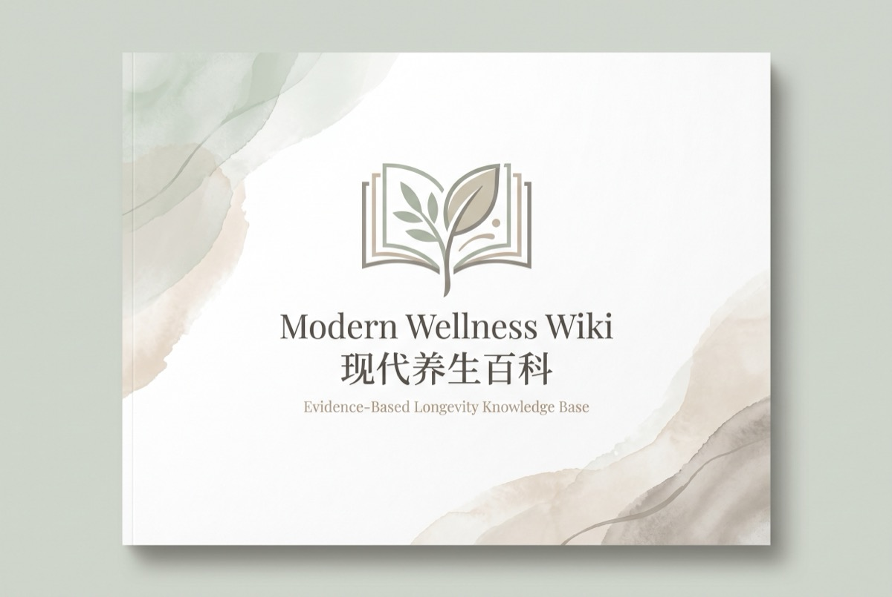

# 现代养生百科

[English](README_en.md)

一个基于循证医学的全因死亡率知识库。

---

## 为什么要建这个

互联网上关于"怎么活得久"的信息太多了——养生号、保健品广告、断章取义的论文标题、互相矛盾的饮食建议。普通人很难分辨哪些是真证据、哪些是噪音。

我们想要一个**普通人能看懂、专业人士挑不出毛病**的长寿指南。

### 核心原则

**所有信息均来自权威研究结论，并提供出处。** 本百科不编造、不推测、不"合理外推"。每个数字、每个结论都能追溯到具体的同行评审论文。如果没有可靠研究支持，就明确标注"证据不足"或"无确定结论"——这本身也是一个准确的结论。

## 目标

- **覆盖所有对全因死亡率有显著影响的因素**——饮食、运动、睡眠、环境、心理、医疗、补剂
- **每个条目都经得起审查**——来源质量、反面证据、利益冲突、人群适用性，逐项审计
- **诚实面对不确定性**——"没有确定结论"也是一个结论

## 如何阅读

### 按分类浏览

`wiki/` 目录按主题组织：

| 目录 | 内容 |
|------|------|
| 动/ | 运动、日常活动、心肺功能 |
| 医/ | 慢性病指标、药物、筛查、疫苗 |
| 吃/ | 食物、营养、饮品、补剂、饮食模式 |
| 境/ | 空气、噪音、温度、社会环境 |
| 形/ | 身体状态：肥胖、肌肉、口腔、感官 |
| 心/ | 情绪、社交、目的感 |
| 睡/ | 睡眠时长、质量、节律 |

二级目录（如 `吃/补剂/`、`动/有氧/`）用于聚合同一话题的多个条目。

### 按死亡率影响排序

每个文件名以死亡率影响前缀命名，在文件系统中按名称排序即可直观看到：

- `+100~300% 吸烟.md` → 危害最大
- `-47% 挥拍运动.md` → 收益最大
- `~ 维生素D.md` → 效果不确定

### 单个条目结构

每个条目包含：
- **死亡率影响**：对全因死亡率的具体影响（数字或"不确定"）
- **证据等级**：1-5 颗星，反映证据强度
- **可操作性**：你能做什么
- **结论**：一句话核心结论
- **证据**：支撑结论的关键研究
- **做**：具体行动建议
- **参考文献**：原始论文链接

## 如何保证有效性

上述原则通过以下机制落地：

### 完整性审计

通过交叉对比 7+ 个权威来源（程序员延寿指南、Blue Zones、Peter Attia《Outlive》、GBD 2019、WHO、Examine.com、Huberman Lab 等），系统性识别缺失条目。

- 审计规范：`条目完整性审计标准.md`
- 审计记录：`完整性审计记录/`

### 权威性审计

每个条目需通过 10 项检查：

1. **来源质量** — 是否来自同行评审期刊、大型 RCT/Meta 分析
2. **结论一致性** — 与主流文献是否一致
3. **反面证据** — 是否有同等质量的反对研究
4. **效果量准确** — 相对风险 vs 绝对风险是否混淆
5. **利益冲突** — 研究资助方是否为利益相关方
6. **因果 vs 相关** — 是否把相关性说成了因果性
7. **人群适用性** — 年龄、性别、种族、健康状态的适用范围
8. **研究局限性** — 偏倚、样本量、随访时长是否被披露
9. **发表偏倚** — 阴性结果是否被忽略
10. **时效性** — 是否有更新的研究可以替代

- 审计规范：`条目权威性审计标准.md`
- 审计记录：`权威性审计记录/`

### 条目撰写标准

每个条目的格式、证据要求、不确定性标注规范，见 `条目撰写标准.md`。

## 贡献

欢迎提交 Issue 或 PR。新条目需通过完整性和权威性双重审计后方可合并。

## 致谢

本项目受 [geekan/HowToLiveLonger](https://github.com/geekan/HowToLiveLonger)（程序员延寿指南）启发，在此基础上扩展为系统性的长寿知识库。

## License

[CC BY-SA 4.0](LICENSE)
