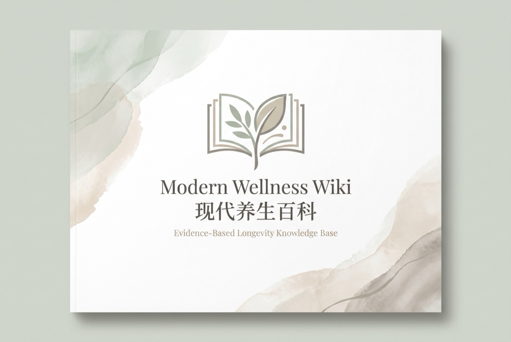

# Modern Wellness Wiki

A bilingual health and longevity knowledge base for general readers, explaining research findings, their limits and relevance to everyday decisions.



**[Read online](https://jageri.github.io/modern-wellness-wiki/README_en)** · [中文](README.md) · [Chinese table index](INDEX.md) · [Feedback and corrections](https://github.com/Jageri/modern-wellness-wiki/issues)

<!-- reader-index:start -->

**100 topics · Chinese and English editions · 10 subject areas.** Choose a topic below, or start with an everyday question.

## Browse by topic

| Topic | Entries | What you can find |
| --- | ---: | --- |
| [Food and nutrition](#food-and-nutrition) | 37 | Foods, drinks, dietary patterns, supplements and food safety |
| [Exercise and activity](#exercise-and-activity) | 14 | Everyday movement, cardio and strength training |
| [Sleep and rest](#sleep-and-rest) | 5 | Sleep duration, naps, sleep environment and apnea |
| [Medical care and prevention](#medical-care-and-prevention) | 12 | Risk management, screening, vaccines, medicines and infections |
| [Body and function](#body-and-function) | 9 | Weight, muscles, bones, oral health and the senses |
| [Mental health and connection](#mental-health-and-connection) | 10 | Emotions, stress, social connections and cognition |
| [Environment and exposure](#environment-and-exposure) | 8 | Air, noise, sun and heat or cold exposure |
| [Home and safety](#home-and-safety) | 2 | Heat protection and emergency preparedness |
| [Travel and driving](#travel-and-driving) | 1 | Drowsy driving and travel safety |
| [Coverage and health resources](#coverage-and-health-resources) | 2 | Medical insurance and socioeconomic factors |

## Start with a decision that matters to you

These are starting points for reading, not a ranking of health benefits. Check who the evidence applies to and its limitations within each entry.

| Your question | Start here |
| --- | --- |
| Start with everyday habits | [Walking](wiki_en/Exercise/Daily/-17%25%20Walking.md) · [Strength Training](wiki_en/Exercise/-15%25%20Strength%20Training.md) · [Insufficient Sleep](wiki_en/Sleep/~%20Insufficient%20Sleep.md) |
| Review food and drink choices | [Fruit & Vegetable Intake](wiki_en/Diet/Dietary%20Patterns/-13%25%20Fruit%20&%20Vegetable%20Intake.md) · [Insufficient Dietary Fiber](wiki_en/Diet/Dietary%20Patterns/~%20Insufficient%20Dietary%20Fiber.md) · [Sugary Drinks](wiki_en/Diet/Beverages/+10~20%25%20Sugary%20Drinks.md) |
| Understand risks found at a checkup | [Hypertension (Uncontrolled)](wiki_en/Medical/~%20Hypertension%20%28Uncontrolled%29.md) · [Hyperglycemia](wiki_en/Medical/~%20Hyperglycemia.md) · [High Cholesterol](wiki_en/Medical/~%20High%20Cholesterol.md) |
| Explore screening and prevention | [Cancer Screening](wiki_en/Medical/~%20Cancer%20Screening.md) · [Vaccination](wiki_en/Medical/~%20Vaccination.md) · [Smoking](wiki_en/Medical/+100~300%25%20Smoking.md) |
| Consider a supplement purchase | [How to Evaluate Supplements](wiki_en/Diet/Supplements/~%20How%20to%20Evaluate%20Supplements.md) · [Vitamin D Supplementation](wiki_en/Diet/Supplements/~%20Vitamin%20D.md) · [NMN and NAD+](wiki_en/Diet/Supplements/~%20NMN%20&%20NAD+.md) |
| Explore stress and mental health | [Stress Management](wiki_en/Mind/Emotions/~%20Stress%20Management.md) · [Depression](wiki_en/Mind/Emotions/~%20Depression.md) · [Social Isolation](wiki_en/Mind/Social%20Connection/+32%25%20Social%20Isolation.md) |

## All entries

Grouped by the same topic directories used in the website sidebar. Every title below links directly to an article.

### Food and nutrition

[Artificial Sweeteners (Non-Sugar Sweeteners)](wiki_en/Diet/~%20Artificial%20Sweeteners.md) · [Betel Nut](wiki_en/Diet/~%20Betel%20Nut.md) · [Chili Peppers](wiki_en/Diet/~%20Chili%20Peppers.md) · [Eggs](wiki_en/Diet/~%20Eggs.md) · [Gut Microbiota](wiki_en/Diet/~%20Gut%20Microbiota.md) · [High Salt / High Sodium](wiki_en/Diet/~%20High%20Salt.md) · [Nuts](wiki_en/Diet/~%20Nuts.md) · [Water Quality](wiki_en/Diet/~%20Water%20Quality.md)

- **Beverages**: [Coffee](wiki_en/Diet/Beverages/~%20Coffee.md) · [Excessive Alcohol Consumption](wiki_en/Diet/Beverages/~%20Excessive%20Alcohol.md) · [Fruit Juice](wiki_en/Diet/Beverages/~%20Fruit%20Juice.md) · [Milk](wiki_en/Diet/Beverages/~%20Milk.md) · [Raw Cocoa Powder](wiki_en/Diet/Beverages/~%20Raw%20Cocoa%20Powder.md) · [Sugary Drinks](wiki_en/Diet/Beverages/+10~20%25%20Sugary%20Drinks.md) · [Tea](wiki_en/Diet/Beverages/~%20Tea.md)

- **Dietary Patterns**: [Caloric Restriction](wiki_en/Diet/Dietary%20Patterns/~%20Caloric%20Restriction.md) · [Carbohydrates](wiki_en/Diet/Dietary%20Patterns/~%20Carbohydrates.md) · [Dietary Fat Quality](wiki_en/Diet/Dietary%20Patterns/~%20Dietary%20Fat%20Quality.md) · [Excessive Red Meat](wiki_en/Diet/Dietary%20Patterns/+12%25%20Excessive%20Red%20Meat.md) · [Fried Foods](wiki_en/Diet/Dietary%20Patterns/~%20Fried%20Foods.md) · [Fruit & Vegetable Intake](wiki_en/Diet/Dietary%20Patterns/-13%25%20Fruit%20&%20Vegetable%20Intake.md) · [Insufficient Dietary Fiber](wiki_en/Diet/Dietary%20Patterns/~%20Insufficient%20Dietary%20Fiber.md) · [Processed Meat](wiki_en/Diet/Dietary%20Patterns/~%20Processed%20Meat.md) · [Protein Intake](wiki_en/Diet/Dietary%20Patterns/~%20Protein%20Intake.md) · [Ultra-Processed Foods](wiki_en/Diet/Dietary%20Patterns/+15~21%25%20Ultra-Processed%20Foods.md) · [White Meat](wiki_en/Diet/Dietary%20Patterns/~%20White%20Meat.md)

- **Food Safety**: [Food Additives](wiki_en/Diet/Food%20Safety/~%20Food%20Additives.md) · [Pregnancy Food Safety](wiki_en/Diet/Food%20Safety/~%20Pregnancy%20Food%20Safety.md)

- **Supplements**: [Collagen](wiki_en/Diet/Supplements/~%20Collagen.md) · [Fish Oil / Omega-3](wiki_en/Diet/Supplements/~%20Fish%20Oil.md) · [Glucosamine](wiki_en/Diet/Supplements/-15%25%20Glucosamine.md) · [How to Evaluate Supplements](wiki_en/Diet/Supplements/~%20How%20to%20Evaluate%20Supplements.md) · [Melatonin](wiki_en/Diet/Supplements/~%20Melatonin.md) · [Multivitamins](wiki_en/Diet/Supplements/~%20Multivitamins.md) · [NMN and NAD+](wiki_en/Diet/Supplements/~%20NMN%20&%20NAD+.md) · [Spermidine](wiki_en/Diet/Supplements/~%20Spermidine.md) · [Vitamin D Supplementation](wiki_en/Diet/Supplements/~%20Vitamin%20D.md)

[Back to topics](#browse-by-topic)

### Exercise and activity

[Exercise Variety](wiki_en/Exercise/~%20Exercise%20Variety.md) · [Strength Training](wiki_en/Exercise/-15%25%20Strength%20Training.md)

- **Cardio**: [HIIT vs Moderate-Intensity Continuous Aerobic Exercise](wiki_en/Exercise/Cardio/~%20HIIT%20vs%20Aerobic.md) · [Racket Sports](wiki_en/Exercise/Cardio/~%20Racket%20Sports.md) · [Swimming](wiki_en/Exercise/Cardio/~%20Swimming.md) · [VO₂ Max and Cardiorespiratory Fitness](wiki_en/Exercise/Cardio/~%20VO2%20Max.md)

- **Daily**: [Balance and Stability Training](wiki_en/Exercise/Daily/~%20Balance%20and%20Stability%20Training.md) · [Breathing Exercises](wiki_en/Exercise/Daily/~%20Breathing%20Exercises.md) · [Housework](wiki_en/Exercise/Daily/~%20Housework.md) · [Physical Inactivity](wiki_en/Exercise/Daily/~%20Physical%20Inactivity.md) · [Sedentary Behavior](wiki_en/Exercise/Daily/~%20Sedentary%20Behavior.md) · [Standing Desk](wiki_en/Exercise/Daily/~%20Standing%20Desk.md) · [Stretching and Flexibility](wiki_en/Exercise/Daily/~%20Stretching.md) · [Walking](wiki_en/Exercise/Daily/-17%25%20Walking.md)

[Back to topics](#browse-by-topic)

### Sleep and rest

[Blue Light Exposure](wiki_en/Sleep/~%20Blue%20Light.md) · [Insufficient Sleep](wiki_en/Sleep/~%20Insufficient%20Sleep.md) · [Napping](wiki_en/Sleep/~%20Napping.md) · [Obstructive Sleep Apnea (OSA)](wiki_en/Sleep/~%20Sleep%20Apnea.md) · [Sleep Environment](wiki_en/Sleep/~%20Sleep%20Environment.md)

[Back to topics](#browse-by-topic)

### Medical care and prevention

[Antibiotics](wiki_en/Medical/~%20Antibiotics.md) · [Cancer Screening](wiki_en/Medical/~%20Cancer%20Screening.md) · [COVID-19 and Infectious Diseases](wiki_en/Medical/~%20COVID-19%20&%20Infectious%20Diseases.md) · [Helicobacter pylori Infection](wiki_en/Medical/~%20Helicobacter%20pylori%20Infection.md) · [High Cholesterol](wiki_en/Medical/~%20High%20Cholesterol.md) · [Hyperglycemia](wiki_en/Medical/~%20Hyperglycemia.md) · [Hypertension (Uncontrolled)](wiki_en/Medical/~%20Hypertension%20%28Uncontrolled%29.md) · [Metformin](wiki_en/Medical/~%20Metformin.md) · [Probiotics](wiki_en/Medical/~%20Probiotics.md) · [Rapamycin](wiki_en/Medical/~%20Rapamycin.md) · [Smoking](wiki_en/Medical/+100~300%25%20Smoking.md) · [Vaccination](wiki_en/Medical/~%20Vaccination.md)

[Back to topics](#browse-by-topic)

### Body and function

[Aging Trajectories](wiki_en/Body/~%20Aging%20Trajectories.md) · [Hearing Protection](wiki_en/Body/~%20Hearing%20Protection.md) · [Muscle Loss / Sarcopenia](wiki_en/Body/~%20Muscle%20Loss.md) · [Obesity](wiki_en/Body/~%20Obesity.md) · [Oral Health](wiki_en/Body/~%20Oral%20Health.md) · [Osteoarthritis](wiki_en/Body/~%20Osteoarthritis.md) · [Osteoporosis](wiki_en/Body/~%20Osteoporosis.md) · [Tooth Brushing](wiki_en/Body/~%20Tooth%20Brushing.md) · [Vision Protection](wiki_en/Body/~%20Vision%20Protection.md)

[Back to topics](#browse-by-topic)

### Mental health and connection

[Music and Dementia](wiki_en/Mind/~%20Music%20and%20Dementia.md)

- **Emotions**: [Bipolar Disorder](wiki_en/Mind/Emotions/+102%25%20Bipolar%20Disorder.md) · [Depression](wiki_en/Mind/Emotions/~%20Depression.md) · [Dopamine Management](wiki_en/Mind/Emotions/~%20Dopamine%20Management.md) · [Hypochondriasis (Pathological Health Anxiety)](wiki_en/Mind/Emotions/+69%25%20Hypochondriasis%20%28Pathological%20Health%20Anxiety%29.md) · [Mindfulness Meditation](wiki_en/Mind/Emotions/~%20Mindfulness%20Meditation.md) · [Stress Management](wiki_en/Mind/Emotions/~%20Stress%20Management.md)

- **Social Connection**: [Religious Affiliation (Evidence Primarily Concerns Service Attendance)](wiki_en/Mind/Social%20Connection/~%20Religious%20Affiliation.md) · [Sense of Purpose](wiki_en/Mind/Social%20Connection/-15~20%25%20Sense%20of%20Purpose.md) · [Social Isolation](wiki_en/Mind/Social%20Connection/+32%25%20Social%20Isolation.md)

[Back to topics](#browse-by-topic)

### Environment and exposure

[Air Pollution](wiki_en/Environment/~%20Air%20Pollution.md) · [Microplastics](wiki_en/Environment/~%20Microplastics.md) · [Noise Pollution](wiki_en/Environment/~%20Noise%20Pollution.md) · [Sun Exposure](wiki_en/Environment/~%20Sun%20Exposure.md)

- **Temperature Therapy**: [Bathing and Cardiovascular Risk](wiki_en/Environment/Temperature%20Therapy/~%20CVD%20Bathing.md) · [Cold Showers](wiki_en/Environment/Temperature%20Therapy/~%20Cold%20Showers.md) · [Finnish-Style Dry Sauna](wiki_en/Environment/Temperature%20Therapy/~%20Finnish-Style%20Dry%20Sauna.md) · [Thermoregulation (Cold/Heat Exposure)](wiki_en/Environment/Temperature%20Therapy/~%20Thermoregulation.md)

[Back to topics](#browse-by-topic)

### Home and safety

[Heat Protection](wiki_en/Housing/~%20Heat%20Protection.md) · [Home Emergency Preparedness](wiki_en/Housing/~%20Home%20Emergency%20Preparedness.md)

[Back to topics](#browse-by-topic)

### Travel and driving

[Drowsy Driving](wiki_en/Travel/~%20Drowsy%20Driving.md)

[Back to topics](#browse-by-topic)

### Coverage and health resources

[Medical Insurance](wiki_en/Wealth/~%20Medical%20Insurance.md) · [Socioeconomic Status](wiki_en/Wealth/~%20Socioeconomic%20Status.md)

[Back to topics](#browse-by-topic)

<!-- reader-index:end -->

## Browse and understand entries

- **Find a specific question**: use search on the [website](https://jageri.github.io/modern-wellness-wiki/README_en), or browse its topic sidebar. On mobile, open the menu to see the directory.
- **Scan brief descriptions**: the [Chinese table index](INDEX.md) lists the studied impact and category for each entry.
- **Understand relevance to you**: read conclusions alongside population limits, practical guidance, evidence limitations and original sources.
- **Trace reviews and updates**: the bottom of each website article links its audit record, review dates and translation. The [review status table](https://jageri.github.io/modern-wellness-wiki/docs/tracking/复审状态) gives an overview.

Filename percentages are not rankings of benefits across entries. See the [filename rules](docs/standards/条目撰写标准.md#文件命名) and [evidence-rating standard](docs/standards/证据评级规范.md) for definitions; these editorial standards are maintained in Chinese.

## Project structure

```text
wiki_zh/   Chinese entries
wiki_en/   English entries
docs/      Current standards and maintenance guides
audits/    Historical audits and correction records
assets/    Project static assets
```

## Contributing and maintenance

Issues and PRs for corrections, evidence updates and new entries are welcome. The [project documentation](docs/README.md) identifies the authoritative document for each rule; the [maintenance guide](docs/tracking/维护说明.md) covers workflow and validation commands; the [backlog](docs/tracking/待完善条目清单.md) tracks proposed topics. These documents are maintained in Chinese.

This project provides general health information, not individualized medical advice. Each entry's review section identifies its audit record and review responsibility.

## Acknowledgments and license

Inspired by [geekan/HowToLiveLonger](https://github.com/geekan/HowToLiveLonger). Content is licensed under [CC BY-SA 4.0](LICENSE).
